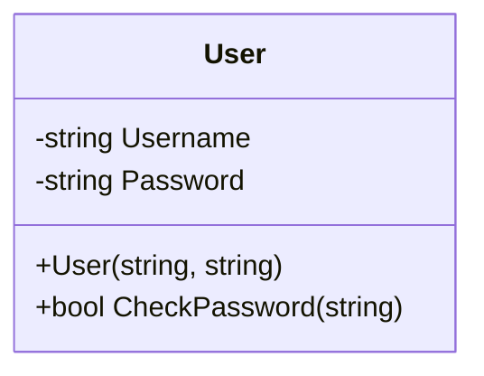
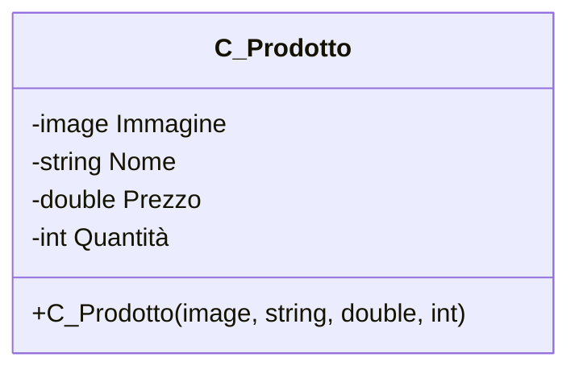

# E-Clothes
Un progetto per gestire un e-commerce in Windows Forms C#

## Da fare
- [ ] Commentare il codice
- [ ] Creare gli schemi UML

## In corso
- [ ] Presentazione PowerPoint

## Fatto ✓
- [x] Crare l'interfaccia di register e login
- [x] Creare l'interfaccia principale

## Framework Utilizzati

**Bunifu** è un framework per migliorare l'interfaccia grafica. Esso include degli elementi grafici non disponibili in WinForms.

## Diagrammi UML

### Diagramma della classe User

### Diagramma della classe C_Prodotto

